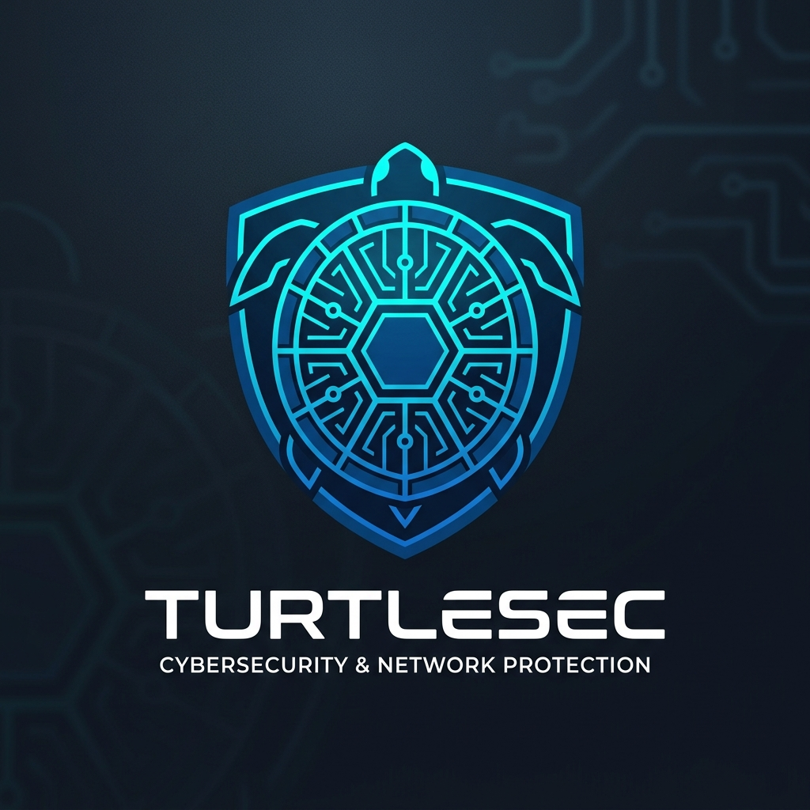
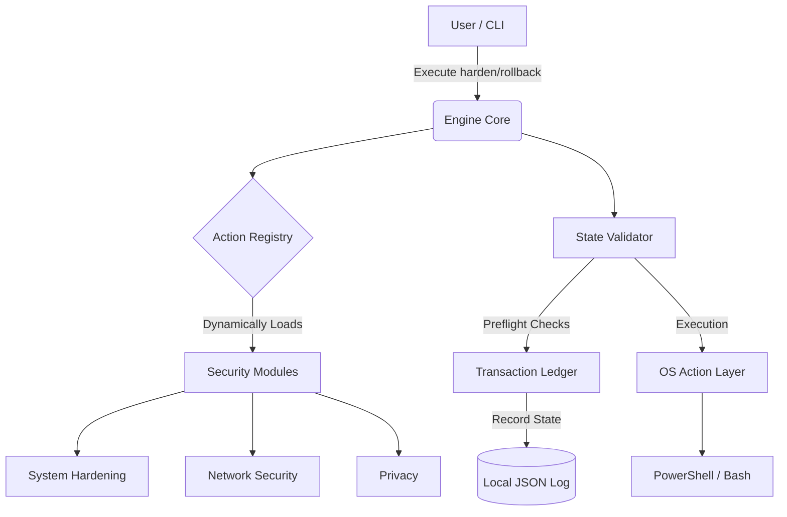

<div align="center">
  
  
  <h1>TORTUGA Cybersecurity Framework</h1>
  <p><em>An Advanced, Idempotent, and Reversible OS Security Orchestrator</em></p>

  <!-- Badges -->
  <p>
    <a href="https://github.com/RichSsa24/TORTUGA/actions"></a>
    
    
    
  </p>

  <p>
    <a href="#english"><strong>Read in English</strong></a> ·
    <a href="#español"><strong>Leer en Español</strong></a>
  </p>
</div>

<br />

---

<h2 id="english">English</h2>

**TORTUGA** is a cross-platform, modular security orchestrator designed to bridge the gap between complex system administration and accessible cybersecurity. Built with modern software engineering principles, it allows both novices and system administrators to apply multi-layered hardening configurations safely.

Unlike aggressive "debloat" scripts that permanently damage systems, TORTUGA acts as a state machine. It evaluates, predicts, applies, and—if necessary—perfectly reverses any system configuration.

### 🌟 Engineering Highlights

This project was developed with a focus on robust software architecture, making it an excellent showcase of modern Python development:

* **Idempotent Execution:** The engine evaluates current OS states before applying changes. Running the framework multiple times yields the exact same safe state without redundant operations.
* **Stateful Transaction Logs:** Every modified registry key, firewall rule, or system policy is recorded in a JSON transaction ledger. This allows for 100% accurate mathematical rollbacks.
* **Abstract Syntax Tree (AST) CLI:** The command-line interface dynamically parses modules and actions via a Registry Pattern, allowing developers to plug-and-play new security modules without altering core logic.
* **Test-Driven:** Protected by a comprehensive `pytest` suite ensuring absolute reliability across the Engine, CLI, Transaction Manager, and OS Action layers.
* **OS-Agnostic Interface:** Seamlessly abstracts PowerShell (`Windows`) and Bash (`Linux`/`macOS`) execution under a unified API layer.

### 🏗️ System Architecture



### 📚 Security Education
Beyond software, TORTUGA aims to provide professionally designed, exportable documentation to educate users on real-world threats. (Guides currently in development).

### 🚀 Quick Start

**Prerequisites:** Python 3.10+ and Administrator/Root privileges.

```bash
# 1. Clone the repository
git clone https://github.com/RichSsa24/TORTUGA.git
cd TORTUGA

# 2. Install dependencies
pip install -r requirements.txt

# 3. Run a Dry-Run Scan (No changes applied)
python -m tortuga harden --module system_hardening --level 3

# 4. Apply Hardening
python -m tortuga harden --module system_hardening --level 3 --apply

# 5. Rollback (Undo changes using the generated RUN_ID)
python -m tortuga rollback <RUN_ID>.json
```

---

<h2 id="español">Español</h2>

**TORTUGA** es un orquestador de seguridad modular y multiplataforma diseñado para cerrar la brecha entre la administración de sistemas compleja y la ciberseguridad accesible. Construido con principios modernos de ingeniería de software, permite tanto a novatos como a expertos aplicar configuraciones de protección por capas de forma segura.

A diferencia de los scripts agresivos que dañan los sistemas permanentemente, TORTUGA actúa como una máquina de estados. Evalúa, predice, aplica y si es necesario, revierte perfectamente cualquier configuración del sistema.

### 🌟 Aspectos Destacados de Ingeniería

Este proyecto fue desarrollado con un enfoque en la arquitectura de software robusta (ideal para revisión técnica y reclutadores):

* **Ejecución Idempotente:** El motor evalúa el estado actual del SO antes de aplicar cambios. Ejecutar el framework múltiples veces da como resultado el mismo estado seguro sin operaciones redundantes.
* **Registro de Transacciones de Estado:** Cada clave de registro, regla de firewall o política modificada se registra en un libro mayor JSON. Esto permite "rollbacks" (reversiones) 100% matemáticamente precisos.
* **Arquitectura de Plugins (Patrón Registry):** La interfaz de línea de comandos analiza módulos y acciones dinámicamente, permitiendo a los desarrolladores integrar nuevos módulos de seguridad sin alterar la lógica central.
* **Test-Driven (Guiado por Pruebas):** Protegido por una suite integral de `pytest` que garantiza una fiabilidad absoluta en el Motor, CLI, Gestor de Transacciones y Capas de Acción del SO.
* **Agnóstico al Sistema Operativo:** Abstrae de forma transparente la ejecución de PowerShell (`Windows`) y Bash (`Linux`/`macOS`) bajo una capa de API unificada.

### 📚 Educación en Ciberseguridad
Más allá del software, TORTUGA busca proporcionar documentación exportable de diseño profesional para educar a los usuarios sobre amenazas del mundo real. (Guías actualmente en desarrollo).

### 🚀 Guía de Inicio

**Requisitos:** Python 3.10+ y privilegios de Administrador/Root.

```bash
# 1. Clonar el repositorio
git clone https://github.com/RichSsa24/TORTUGA.git
cd TORTUGA

# 2. Instalar dependencias
pip install -r requirements.txt

# 3. Escaneo de Simulación (Dry-Run, sin aplicar cambios)
python -m tortuga harden --module system_hardening --level 3 --lang es

# 4. Aplicar Protección
python -m tortuga harden --module system_hardening --level 3 --lang es --apply

# 5. Reversión (Deshacer cambios usando el RUN_ID generado)
python -m tortuga rollback <RUN_ID>.json --lang es
```

---

<div align="center">
  <p><small>Desarrollado con ❤️ para un entorno digital más seguro. Licencia MIT.</small></p>
</div>
